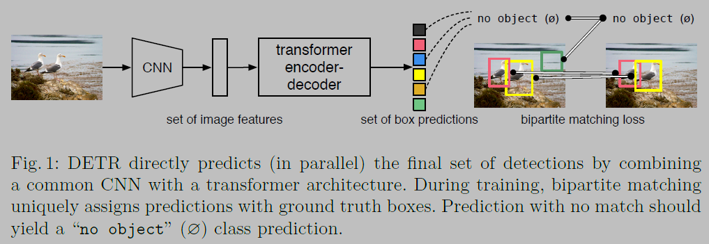
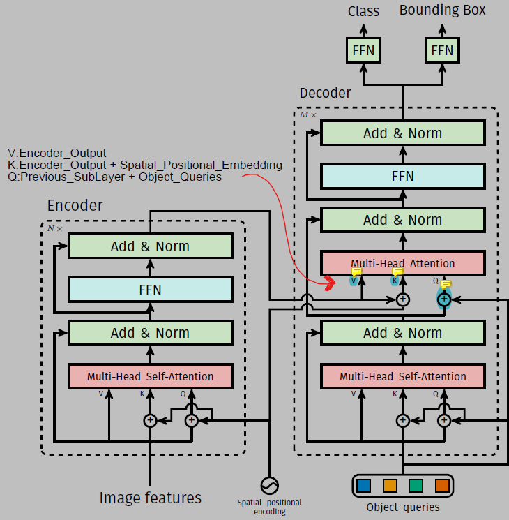

# DETR

 ## Introduction

  * The approach streamlines the detection pipeline, effectively removing the need for many hand-designed components like a non-maximum suppression procedure or anchor generation that explicitly encode our prior knowledge about the task
  * DETR can be easily generalized to produce panoptic segmentation
  in a unified manner
  * The goal of object detection is to predict a set of bounding boxes and category labels for each object of interest. Modern detectors address this set prediction task in an indirect way, by defining surrogate regression and classification problems on a large set of proposals, anchors, or window centers.
  * To simplify these pipelines, we propose a direct set prediction approach to bypass the surrogate tasks. We streamline the training pipeline by viewing object detection as a direct set prediction problem
  * DETR simplifies the detection pipeline by dropping multiple hand-designed components that encode prior knowledge, like spatial anchors or non-maximal suppression. Doesn't require any customized layers
  * DETR demonstrates significantly better performance on large objects, a result likely enabled by the non-local computations of the transformer. It obtains, however, lower performances on small objects
  * The new model requires an extra-long training schedule and benefits from auxilary decoding losses in the transformer
  * The design ethos of DETR easily extends to more complex tasks. In our experiments, we show that a simple segmentation head trained on top of a pre-trained DETR outperforms competitive baselines on Panoptic Segmentation
  * The first difficulty in these tasks is to avoid near-duplicates. Most current detectors use postprocessing such as non-maximal suppression to address this issue, but direct set predictions are postprocessing-free
  * They need global inference schemes that model interactions between all predicted elements to avoid redundancy. For constant-size set prediction, dense fully connected networks are sufficient but costly. A general approach is to use auto-regressive sequence models such as RNNs
  * DETR pipeline
  

## The DETR model
  1. A set prediction loss that forces unique matching between predicted and ground truth boxes while training
  2. An architecture that predicts (in a single pass) a set of objects and models their relation

  ### Object detection set prediction loss
  *  DETR infers a fixed-size set of N predictions, in a single pass through the decoder, where N is set to be significantly larger than    the typical number of objects in an image
  * One of the main dificulties of training is to score predicted objects `(class_probs, (x_center, y_center, h, w))` with respect to the ground truth
  * To find a bipartite matching between these two sets we search for a permutation of `N` elements `σ ∈ ς_N` with the lowest cost:
    
    
    where `L_match` is the pair wise matching cost between ground truth `y_i` and prediction `y_σ(i)`

    `L_match =`
    
    
    
    for the prediction with index `σ(i)` we define probability of class `ci` as `^p_σ(i)(ci)` and the predicted box as `^b_σ(i)`
  * The main difference with others is that we find one-to-one matching for direct set prediction without duplicates
  * We apply, Hungarian loss for all pairs matched in the previous step. We define the loss similarly to the losses of common object detectors, i.e. a linear combination of a negative log-likelihood for class prediction and a box loss defined later

    

    where `^σ` is the optimal assignment

  * The most commonly-used `L1` loss will have different scales for small and large boxes even if their relative errors are similar. To mitigate this issue we use a linear combination of the `L1` loss and the `generalized IoU loss`.

    `L_box = `

    

  ### DETR Architecture

  #### CNN BackBone
   * `x.shape = (H_0, W_0, 3) =CONV BACKBONE=> f.shape = (H, W, C)` where `H, W = H_0/32, W_0/32` and `C = 2048`
   * The input images are batched together, applying 0-padding adequately to ensure they all have the same dimensions (H0;W0) as the largest image of the batch

   * Then a `1*1 convolution` reduces the channel dimension from `C` to `d` giving `z_0.shape = (H, W, d)`
   * Now we flatten it to get a feature map of shape `(H*W, d)`
  ### Transformer
  
  
  #### Transformer encoder
   * We add fixed positional encoding to the transformer

  #### Transformer decoder
   * The decoder follows the standard architecture of the transformer, transforming `N` embeddings of size `d` using multi-headed self- and
    encoder-decoder attention mechanisms. The difference with the original transformer is that our model decodes the `N` objects in parallel at each decoder layer, while in the original transformer paper the model predicts autoregressively.
   * As the decoder is also permutation-invariant, the `N` input embeddings must be different to produce different results. These input   embeddings are learned positional encodings that we refer to as object queries, and we add them to the input of each attention layer
   * The `N` object queries are transformed into an output embedding by the decoder. They are then independently decoded into box coordinates and class labels by a feed forward network (described in the next subsection), resulting `N` final predictions. Using self- and encoder-decoder attention over these embeddings, the model globally reasons about all objects together using pair-wise relations
   between them, while being able to use the whole image as context.

  #### FFN (Feed Forward Network)
   *  ```python
      def FFN(x):
        bbox_pred = Dense(4, activation="softmax")(x)
        class_probs = Dense(n_classes)(x)
        return class_probs, bbox_pred # (c, b)          
      ```
   * We add prediction FFNs and Hungarian loss after each decoder layer. 
   * All predictions `FFN`s share their parameters.
   * We use an additional shared `layer-norm` to normalize the input to the prediction `FFN`s from different decoder layers.

### Train Details
   * `AdamW` optimizer ([`tfa.optimizers.MultiOptimizer`: Different optimizer for different layers](https://www.tensorflow.org/addons/api_docs/python/tfa/optimizers/MultiOptimizer))
     * Initial `lr(CNN) = 1e-5` & `weight_decay = 1e-4` 
     * Initial `lr(transformer) = 1e-4` & `weight_decay = 1e-4`
     * Example usage

        ```python
        model = ...
        optimizers = [
          tf.optimizers.AdamW(learning_rate=1e-5, weight_decay=1e-4),
          tf.optimizers.AdamW(learning_rate=1e-4, weight_decay=1e-4)]

        optimizers_and_layers = [(optimizers[0], model.layers[0]), (optimizers[1], model.layers[1:])]
        optimizer = tfa.optimizers.MultiOptimizer(optimizers_and_layers)
        model.compile(optimizer=optimizer, loss="mse")
        ```

   * Increase the feature resolution by adding a dilation to the last stage of the backbone and removing a stride from the first convolution of this stage. This modification increases the resolution by a factor of two, thus improving performance for small objects, at the cost of a 16x higher cost in the self-attentions of the encoder, leading to an overall 2x increase in computational cost
   * We also apply random crop augmentations during training. A train image is cropped with probability 0.5 to a random rectangular patch which is then resized again to 800-1333
   * In the transformer we keep the `dropout_rate = 0.1`

## Results
* To be added

## Appendix
* To be added (explain the matching part in detail)

# Research Paper and References
* [**Paper**: End-to-End Object Detection with Transformers](https://arxiv.org/abs/2005.12872)
